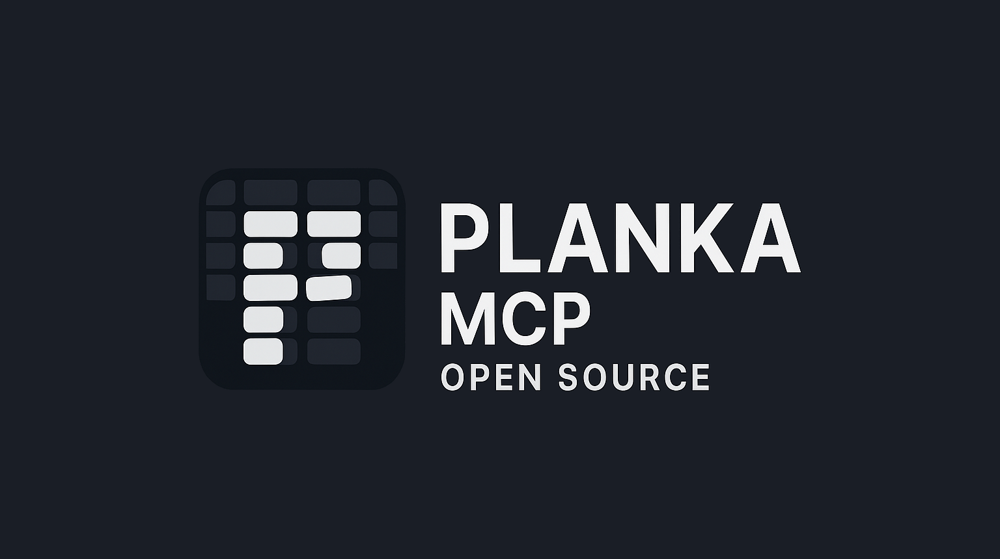

# Planka MCP

> **Manage your Planka Kanban boards, cards, lists, and labels via the Model Context Protocol (MCP) server.**

---

## 🚀 Quick Start

Run the MCP server instantly with NPX (no install required):

```bash
npx planka-mcp
```
This will start the MCP server and expose your Planka integration.

---

## 🛠 Features
- MCP server for Planka **V2**
- Dynamic tool registration for Planka resources
- Environment variable support via `.env`
- CLI and NPX support for easy usage

---

## 📝 Getting Started (Development)

1. **Install dependencies:**
   ```bash
   npm install
   ```

2. **Configure environment variables:**
   Create a `.env` file in the project root:
   ```env
   PLANKA_EMAIL_OR_USERNAME=admin
   PLANKA_PASSWORD=admin
   PLANKA_API_URL=http://example.com/api
   ```

3. **Build and run locally:**
   ```bash
   npm run build
   node dist/index.js
   ```
   Or, use NPX after publishing:
   ```bash
   npx planka-mcp
   ```

---

## 💡 Usage Examples

Start the MCP server (default):
```bash
npx planka-mcp
```

You can also use the CLI in scripts or integrate with other tools that support MCP.

---

## 🖥️ VS Code Integration (Optional)

To connect VS Code to your locally built MCP server, create a `.vscode/mcp.json` file:

```jsonc
{
  "servers": {
    "planka": {
      "type": "stdio",
      "command": "npx",
      "args": [
        "-y",
        "node",
        "dist/index.js"
      ]
    }
  }
}
```
This configuration allows VS Code to launch and connect to your MCP server using the local build.

---

## 📁 Project Structure

- `src/index.ts`: Main entry point
- `src/lib/planka.ts`: Planka API integration
- `src/tools/`: MCP resource tools (boards, cards, lists, labels, projects)

---

## ✅ TODO

- [x] Publish a real release to enable NPX usage
- [x] Board management tool (`src/tools/boards.ts`)
- [x] Card management tool (`src/tools/cards.ts`)
- [x] List management tool (`src/tools/lists.ts`)
- [x] Label management tool (`src/tools/labels.ts`)
- [x] Project management tool (`src/tools/projects.ts`)
- [x] Support assigning members to cards (`src/tools/memberships.ts`)
- [x] Enhance label management (e.g., editing, deleting, filtering)
- [x] Add support for card tasks/subtasks (checklists)

---

## 📄 License
MIT
